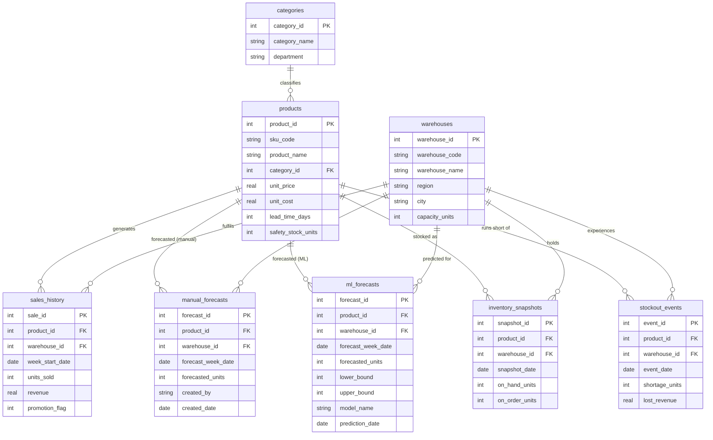

# P3 — Forecasting Accuracy · Data Dictionary & Schema

This document describes the SQLite database (`forecasting.db`) that powers the
forecasting-accuracy dashboard. It satisfies the *Data Structure and Sample
Data* deliverable of the project.

---

## 1. Entity-Relationship Diagram

Paste the block above into [mermaid.live](https://mermaid.live) to render the
diagram for your report.

---

## 2. Design Rationale

The schema is organised around three layers:

**Reference / master data** — `categories`, `products`, `warehouses`. Static
dimensions that slice every fact table.

**Forecasting facts** — `sales_history` (actuals), `manual_forecasts`
(baseline, biased), `ml_forecasts` (improved). Keeping actuals and each
forecast source in separate tables preserves auditability, lets us compare any
two forecast methods side-by-side, and supports appending new models
(e.g. `Prophet`, `LightGBM`) without schema changes.

**Downstream impact** — `inventory_snapshots` tracks weekly stock position,
`stockout_events` records the hard business cost of under-forecasting. These
close the loop between forecast error and customer impact.

The view **`v_forecast_accuracy`** pre-joins actuals with both forecasts and
computes absolute error, bias, and MAPE — this is the one object the
dashboard queries for 80% of its tiles.

---

## 3. Table Reference

### 3.1 `categories`
| Column | Type | Notes |
|---|---|---|
| `category_id` | INTEGER PK | |
| `category_name` | TEXT | e.g. Electronics, Apparel |
| `department` | TEXT | Higher-level grouping |

### 3.2 `products` (30 rows)
| Column | Type | Notes |
|---|---|---|
| `product_id` | INTEGER PK | |
| `sku_code` | TEXT UNIQUE | e.g. `ELC-001` |
| `product_name` | TEXT | |
| `category_id` | INTEGER FK → `categories` | |
| `unit_price` | REAL | Selling price (INR) |
| `unit_cost` | REAL | COGS (INR) |
| `lead_time_days` | INTEGER | Supplier lead time |
| `safety_stock_units` | INTEGER | Policy buffer at the DC |

### 3.3 `warehouses` (4 rows)
| Column | Type | Notes |
|---|---|---|
| `warehouse_id` | INTEGER PK | |
| `warehouse_code` | TEXT UNIQUE | e.g. `WH-BLR` |
| `warehouse_name` | TEXT | |
| `region` | TEXT | North / South / East / West |
| `city` | TEXT | Bengaluru, Mumbai, Delhi, Kolkata |
| `capacity_units` | INTEGER | |

### 3.4 `sales_history` (18,720 rows · actuals, grain = SKU × DC × week)
| Column | Type | Notes |
|---|---|---|
| `sale_id` | INTEGER PK | |
| `product_id` | INTEGER FK | |
| `warehouse_id` | INTEGER FK | |
| `week_start_date` | DATE | Monday of the ISO week |
| `units_sold` | INTEGER | Demand actual |
| `revenue` | REAL | `units_sold × unit_price` |
| `promotion_flag` | INTEGER | 1 if week was on promotion (~3% of weeks) |

### 3.5 `manual_forecasts` (18,720 rows)
Baseline planner-generated forecasts carrying a systematic SKU-level bias —
the *problem* the project addresses.
| Column | Type | Notes |
|---|---|---|
| `forecast_id` | INTEGER PK | |
| `product_id` | INTEGER FK | |
| `warehouse_id` | INTEGER FK | |
| `forecast_week_date` | DATE | Week being forecasted |
| `forecasted_units` | INTEGER | |
| `created_by` | TEXT | Planner name |
| `created_date` | DATE | 1 week before the forecast week |

### 3.6 `ml_forecasts` (18,720 rows)
ML-generated forecasts (synthetic placeholder until the real model is
trained; schema supports multiple models via `model_name`).
| Column | Type | Notes |
|---|---|---|
| `forecast_id` | INTEGER PK | |
| `product_id` | INTEGER FK | |
| `warehouse_id` | INTEGER FK | |
| `forecast_week_date` | DATE | |
| `forecasted_units` | INTEGER | |
| `lower_bound` | INTEGER | 85% prediction interval lower |
| `upper_bound` | INTEGER | 85% prediction interval upper |
| `model_name` | TEXT | e.g. `SARIMA+XGBoost` |
| `prediction_date` | DATE | When the forecast was produced |

### 3.7 `inventory_snapshots` (18,720 rows)
Weekly stock position driven by forecast-based replenishment.
| Column | Type | Notes |
|---|---|---|
| `snapshot_id` | INTEGER PK | |
| `product_id` | INTEGER FK | |
| `warehouse_id` | INTEGER FK | |
| `snapshot_date` | DATE | |
| `on_hand_units` | INTEGER | |
| `on_order_units` | INTEGER | Units ordered that week |

### 3.8 `stockout_events` (1,162 rows)
Every week where on-hand stock couldn't cover demand — the hard business
cost of forecast error.
| Column | Type | Notes |
|---|---|---|
| `event_id` | INTEGER PK | |
| `product_id` | INTEGER FK | |
| `warehouse_id` | INTEGER FK | |
| `event_date` | DATE | |
| `shortage_units` | INTEGER | Units short of demand |
| `lost_revenue` | REAL | `shortage_units × unit_price` |

### 3.9 `v_forecast_accuracy` (view — dashboard's main fact object)
Pre-joins actuals, manual forecast and ML forecast with derived metrics:
- `manual_bias_units`, `ml_bias_units` — signed error (negative = forecast was too low)
- `manual_abs_error`, `ml_abs_error` — absolute unit error
- `manual_mape`, `ml_mape` — percentage error per row

---

## 4. Data Generation Assumptions

- **Time range:** 2023-01-02 → 2025-12-29 (156 weeks).
- **Demand model:** `actual = base × seasonality × trend × lognormal_noise × promo_mult`.
- **Seasonality:** annual sine wave, amplitude and peak-week differ per SKU
  (winter jacket peaks wk 2, swimwear wk 18, ice cream wk 18, hot chocolate wk 2, etc.).
- **Trend:** linear growth or decline per SKU (-8% to +20% per year).
- **Noise:** lognormal with σ = 0.10–0.35 depending on SKU volatility.
- **Promotions:** ~3% of weeks per SKU×DC, with 2× – 3.5× demand uplift.
- **Manual forecast bias:** SKU-specific, range −30% to +45% — simulates chronic
  over-/under-forecasting by human planners.
- **ML forecast:** synthetic for now — lognormal σ = 0.08, no bias. Will be
  replaced by actual model output in the ML phase.
- **Market size multipliers:** Mumbai 1.20×, Delhi 1.15×, Bengaluru 1.00×, Kolkata 0.70×.

---

## 5. Headline Numbers (what your dashboard will surface)

| Metric | Value |
|---|---|
| Manual forecast MAPE | **29.6 %** |
| ML forecast MAPE | **18.3 %** |
| Absolute improvement | **11.3 percentage points** |
| Relative improvement | **38.1 %** |
| Stockout events (3 yrs) | 1,162 |
| Lost revenue from stockouts (3 yrs) | **₹13.59 Cr** |
| Worst category (manual MAPE) | Sports & Outdoor (36.2 %) |
| Worst SKU (manual MAPE) | Ski Gloves @ Mumbai (59.4 %) |

These are the numbers that anchor the executive-summary tiles at the top of
the dashboard.
